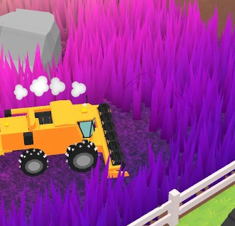
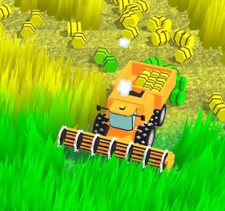

# Grass / Vegetation / Fur

| Name | Picture | Description | Link |
|------|---------|-------------|------|
| Mow It (Grass) |  | Animated and interactive grass system. | [Google Play](https://play.google.com/store/apps/details?id=com.igdclub.mowit) |
| Mow It All (Grass) |  | Animated and interactive grass system. | [Google Play](https://play.google.com/store/apps/details?id=com.igdclub.mowitall) |
| Layered Grass |  | Grass shader made with the technique that is typically used for fur. | [GitHub](https://github.com/Delt06/unity-graphics#layered-grass) |
| Billboard Grass |  | A animated billboard grass shader with LOD system. | [GitHub](https://github.com/Delt06/unity-graphics#billboard-grass) |
| Geometry Grass |  | Grass implemented with geometry shaders. | [GitHub](https://github.com/Delt06/unity-graphics#geometry-grass) |
| URP Toon Shader (Fur) |  | Fur implementation for URP Toon Shader using shell rendering.  | [GitHub](https://github.com/Delt06/urp-toon-shader) |
