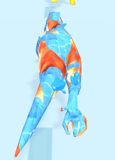
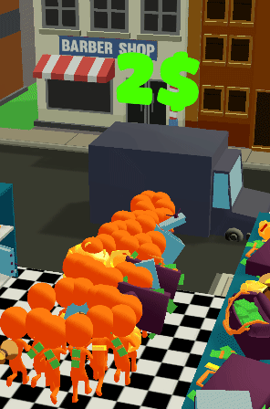

# Other

Effects, which did not fit into any other category.

| Name | Picture | Description | Link |
|------|---------|-------------|------|
| Animation Texture Baking |  | An editor utility and a shader for animation texture baking (VAT). | [GitHub](https://github.com/Delt06/animation-texture-baking) |
| Dino Evolution (Blending) |  | A system for smooth blending between visuals for different elements. | [Google Play](https://play.google.com/store/apps/details?id=kaiju.monster.dna.runner) |
| Room Rush (Truck) |  | Truck body inflation shader. | [Google Play](https://play.google.com/store/apps/details?id=room.rush.puzzle) |
| Shockwave |  | Spawns a temporary screens-space distortion effect on each click. | [GitHub](https://github.com/Delt06/opaque-texture-shaders) |
| Black Hole |  | A simple black hole effect. | [GitHub](https://github.com/Delt06/opaque-texture-shaders) |
| Matcap |  | Basic matcap (material capture) shader. | [GitHub](https://github.com/Delt06/unity-graphics#matcap) |
| Parallax Ice |  | Ice shader imitating depth. | [GitHub](https://github.com/Delt06/unity-graphics#parallax-ice) |
| Toon Terrain |  | Lightweight toon terrain shader. | [GitHub](https://github.com/Delt06/unity-graphics#toon-terrain) |
| Fog Skybox |  | A skybox shader that blends with fog. | [GitHub](https://github.com/Delt06/unity-graphics#fog-skybox) |
| URP Toon Shader (Additive matcap) |  | - | [GitHub](https://github.com/Delt06/urp-toon-shader-custom) |
| URP Toon Shader (Hand-drawn ramp) |  | - | [GitHub](https://github.com/Delt06/urp-toon-shader-custom) |
| URP Toon Shader (Triplanar mapping) |  | - | [GitHub](https://github.com/Delt06/urp-toon-shader-custom) |
| URP Toon Shader (Vertex animation) |  | - | [GitHub](https://github.com/Delt06/urp-toon-shader-custom) |
